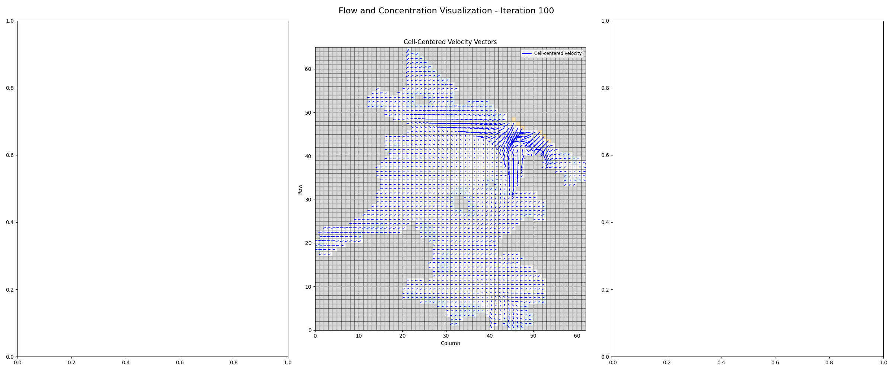

<div align="center">

# BTNet — Bivalve Transmissible Neoplasia Simulator


**An agent-based model for simulating the spread of transmissible cancer in clam populations**

[](https://python.org)
[](https://numpy.org)
[](https://matplotlib.org)
[](#)

[Overview](#overview) · [Demo](#demo) · [Features](#key-features) · [Getting Started](#getting-started) · [Architecture](#architecture) · [Reports](#reports)

</div>

---

## Overview

**BTNet** is an agent-based model (ABM) that simulates the spread of **Bivalve Transmissible Neoplasia (BTN)** — a contagious cancer — across clam populations in **Malpeque Bay, Prince Edward Island, Canada**. The simulation couples a 2D incompressible fluid dynamics solver with epidemiological compartment modelling, allowing researchers to study how ocean currents transport cancerous cells between geographically distinct clam beds and evaluate potential treatment interventions.

The model represents Malpeque Bay as a **62 × 65 staggered grid** (1,722 water cells) derived from real GeoJSON tile data, with **23 identified clam populations** containing approximately 1.25 million clams per cell. Disease dynamics follow an **S → L → I → D** (Susceptible → Latent → Infected → Dead) compartment model, with recovery possible through pharmaceutical intervention.

## Demo

https://github.com/user-attachments/assets/94add4cb-dc54-4031-af4f-f188cd748828

## Key Features

### Fluid Dynamics Engine
- **Semi-Lagrangian advection** on a MAC (Marker-and-Cell) staggered grid
- **Pressure projection** using Red-Black Gauss-Seidel with alternating update order for reduced directional bias
- **Incompressibility enforcement** ensuring divergence-free velocity fields
- **Configurable ocean current sources** with bearing-based injection vectors (130° and 110°)
- **Stochastic wind forcing** with randomized direction and magnitude
- **Progressive velocity dampening** to maintain numerical stability

### Disease Transmission Model
- **SLID compartment model**: Susceptible → Latent → Infected → Dead
- **Waterborne transmission** via BTN cell concentration advected by ocean currents
- **Dose-response infection** using a log-logistic function (ID₅₀ = 800 BTN cells/clam)
- **Filtration-based exposure**: clams filter 0.0524 m³/day, ingesting BTN cells from surrounding water
- **Natural BTN decay**: 50% reduction in free-floating BTN concentration every 50 iterations
- **Dynamic BTN release**: infected clams shed ~100 BTN cells per clam into the water column

### Treatment Intervention
- **Drug concentration advection** — pharmaceutical agents spread through the water following fluid dynamics
- **Pharmacodynamic recovery** — drug effect modelled with Michaelis-Menten kinetics (`E = C / (C + K_d)`)
- **Configurable treatment schedules** — adjustable drop locations, concentrations, and application intervals
- **Drug consumption modelling** — concentration depletes proportionally to the number of recovered clams

### Visualization & Animation
- Real-time **concentration heatmaps** for both BTN and drug distributions
- **Cell-centered velocity vector fields** and staggered grid flow visualization
- **Per-population time-series plots** tracking healthy, latent, infected, and dead clam counts
- **MP4 animation export** via FFmpeg with configurable frame rates and resolution
- **Interactive Solara dashboard** for step-by-step simulation exploration

## Study Area

<div align="center">


*23 distinct clam populations identified in Malpeque Bay via BFS connectivity analysis*
</div>

The simulation grid is derived from geospatial tile data (`malpeque_tiles.geojson`) capturing the coastline geometry of Malpeque Bay. Land cells act as no-slip boundaries, while source cells at the bay entrance inject tidal currents.

## Getting Started

### Prerequisites

- Python 3.12+
- FFmpeg (for animation export)

### Installation

```bash
# Clone the repository
git clone https://github.com/your-username/BTNet.git
cd BTNet

# Install dependencies
pip install -r requirements.txt
```

### Quick Start

**Run a full animation scenario:**
```bash
python animation.py
```
This will generate MP4 animations in the `output_animations/` directory with default parameters:
- 100 frames × 10 simulation steps per frame = 1,000 total steps
- Patient zero in Population 10
- Drug treatment at 3 locations every 20 steps

**Run an interactive simulation:**
```bash
python abm.py
```

**Identify and visualize clam populations:**
```bash
python identify_populations.py
```

### Configuration

Key simulation parameters can be tuned in `animation.py`:

| Parameter | Default | Description |
|---|---|---|
| `num_frames` | 100 | Total animation frames |
| `steps_per_frame` | 10 | Simulation steps per frame |
| `dt` | 350 | Advection timestep |
| `projection_loops` | 20 | Gauss-Seidel iterations per step |
| `overrelaxation` | 1.5 | SOR parameter for pressure solve |
| `population_id` | 10 | Patient zero population (1–23) |
| `btn_zero_frame` | 1 | Iteration to introduce disease |
| `drug_drop` | `[(54,28),(49,43),(37,47)]` | Drug application coordinates |
| `drug_concentration` | 0.1 | Drug amount per application |
| `drug_drop_interval` | 20 | Steps between drug applications |

## Architecture

```
BTNet/
├── abm.py                    # Core ABM with visualization functions
├── animation.py              # Animation pipeline & scenario runner
├── disease.py                # SLID compartment model & concentration advection
├── grid_generator.py         # GeoJSON → staggered grid with boundary conditions
├── mechanisms.py             # Fluid solver (advection, projection, dampening)
├── identify_populations.py   # BFS population detection & statistics
├── visuals.py                # Solara interactive dashboard
├── malpeque_tiles.geojson    # Geospatial grid data for Malpeque Bay
├── images/                   # Documentation assets
└── output/                   # Generated animations & plots
```

### Module Dependency Graph

```
malpeque_tiles.geojson
        │
        ▼
  grid_generator.py ──── FlowPolygonAgent (agent class)
        │                 extract_grid_indices()
        │                 create_grid_agents()
        │                 assign_edge_velocities()
        │
        ├──────────────────────┐
        ▼                      ▼
  mechanisms.py            disease.py
  ├ advect_velocities()    ├ advect_concentrations()
  ├ project_velocities()   ├ advect_btn_concentrations()
  ├ wind()                 ├ update_clam_population()
  └ run_simulation()       ├ initialize_clam_cancer()
        │                  └ drop_concentration()
        │                      │
        ├──────────┬───────────┘
        ▼          ▼
   animation.py  abm.py
   (MP4 export)  (interactive)
        │
        ▼
    visuals.py
    (Solara dashboard)
```

### Simulation Pipeline

Each simulation step executes the following sequence:

1. **Wind forcing** — Random wind perturbation applied to edge velocities
2. **Pressure projection** — Red-Black Gauss-Seidel enforces ∇·**v** = 0
3. **Velocity advection** — Semi-Lagrangian backtracking with bilinear interpolation
4. **Concentration advection** — Drug and BTN concentrations transported by flow
5. **Population update** — Infection, latency transition, death, and drug recovery
6. **Stability check** — Progressive dampening applied if velocities exceed threshold

## Mathematical Details

### Fluid Dynamics
The velocity field is stored on a **staggered (MAC) grid** where horizontal velocities live on vertical cell edges and vertical velocities live on horizontal cell edges. Advection uses a **semi-Lagrangian scheme**: for each edge, the departure point is found by backtracking along the velocity field, then the new velocity is obtained via bilinear interpolation. Pressure projection solves:

$$\nabla \cdot \mathbf{v} = 0$$

using an iterative **Red-Black Gauss-Seidel** method with overrelaxation, distributing corrections equally among unlocked cell edges.

### Disease Model
The infection probability for each clam follows a **log-logistic dose-response curve**:

$$P(\text{infection}) = \frac{1}{1 + e^{-\beta(\ln D - \ln D_{50})}}$$

where *D* is the BTN dose per clam (filtration rate × water concentration) and *D₅₀* = 800 cells. Drug efficacy follows **Michaelis-Menten kinetics**:

$$E_{\text{drug}} = \frac{C}{C + K_d}$$

where *C* is the local drug concentration and *K_d* dynamically scales with the infected population.

## Reports

| Document | Link |
|---|---|
| Solo Report | [Read on Google Drive](https://drive.google.com/file/d/1vyO6SJr6jT7d55yk80HX-34BSrDjlJyt/view?usp=sharing) |
| Group Report | [Read on Google Drive](https://drive.google.com/file/d/1aF58qj8jrLxBrnqpu38FLws_M0md5747/view?usp=sharing) |

## Gallery

<div align="center">

| Velocity Field | Ocean Currents |
|---|---|
|  |  |

| Complete Grid | Simulation Output |
|---|---|
|  |  |

</div>

## Tech Stack

| Component | Technology |
|---|---|
| Core simulation | NumPy |
| Geospatial processing | Shapely, GeoPandas |
| Visualization | Matplotlib |
| Interactive dashboard | Solara |
| Animation export | FFmpeg |
| Grid data | GeoJSON (QGIS-generated) |

## License

This project was developed for academic research purposes. Please cite the associated reports if you use this work.

---

<div align="center">

*Built for computational ecology*

</div>
